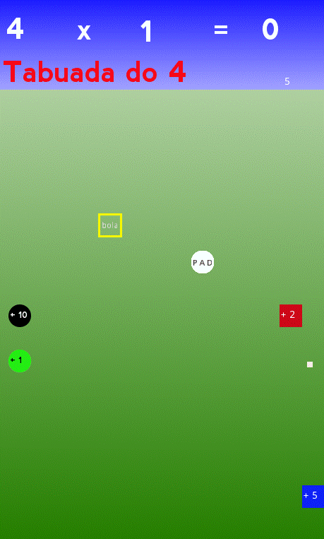
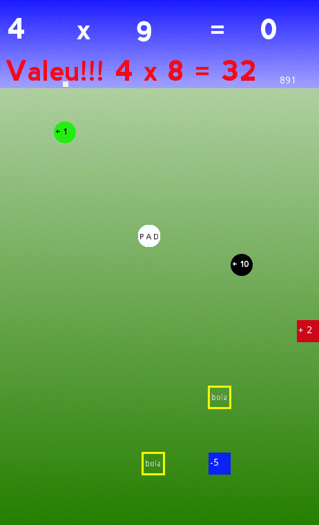

# **Tablas de Multiplicar Pong**

  

# Acerca de
> Este sencillo juego 2D es parte de un conjunto experimental de juegos educativos, desarrollado con el Godot Engine usando el lenguaje GDScrip. (similar a python)
> Resuelve las tablas jugando un juego tipo pong. (todavía en desarrollo)
>
>  

# Aspectos
> - Este juego está en desarrollo.
> - Este es un juego de pong donde tú, jugando, debes resolver tablas de multiplicar.
> - Las tablas varían aleatoriamente de 2 a 12.
> - Las posiciones de los cuadrados numéricos también se generan aleatoriamente.
> - El resultado de cada multiplicación se define por la suma de los impactos de la pelota o pad en los cuadrados numerados.
> - Atención: la velocidad de la pelota cambia con la velocidad del impacto de el pad.
> - El impacto de el pad también cambia el signo del cuadrado numerado (p. ej., 5 se convierte en -5).
> - En cada impacto, el cuadrado numerado cambia de posición al azar.
> - El cuadrado amarillo lanza una nueva bola cuando es golpeado.
> - Atención: puede haber muchas bolas a la vez.
> - Cuidado: pueden aparecer nuevos cuadrados amarillos al mismo tiempo.
> - Hay un contador de tiempo, por ahora, simplemente para su propia información.
> - Ganas el juego completando una tabla respectiva.

# Diseños
> ## Una página de inicio típica
> - El tipo de tabla y la posición de los cuadrados se generan aleatoriamente.
> 

> ## En medio de un juego típico.
> - Felicidades, obtuviste el resultado d 4 x 8 bien!!!
> - ¡¿Resolvamos ahora 4 x 9?!
> 

# Modelos
> - Godot adopta en esencia un diseño orientado a objetos con un sistema flexible de escenas y jerarquías de nodos.
> - Árboles de nodos (nodo: el bloque de construcción más pequeño) que los agrupan en escenas.
> - Los nodos se comunican entre sí a través de señales.
> - Un script en el lenguaje GDScript es una clase que extiende (hereda) una clase de nodo o una nueva clase original.

# Tecnologías
> - Godot engine 2.1.4
>     - http://downloads.tuxfamily.org/godotengine/2.1.4/
> - GDScript (parecido com python)

# Ejecutar el juego
> - Descarga Godot y el juego.
> - Inicie godot e importe el archivo engine.cfg en el directorio raíz del juego.
> - Ejecutar en modo desarrollo o compilar (exportar) para android, ios, windows, linux, etc.

# Autor
> Pedro Vitor Abreu
>
> <soft.pva@gmail.com>
>
> <https://github.com/softpva>
