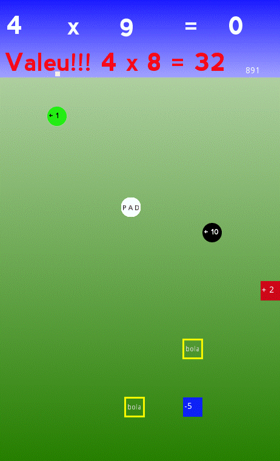

# **Pong Multiplication Tables**

  

# About
> This very simple 2D game is part of a experimental set of educational games built in godot engine using gdscript language. (like python)  
> Solve the multiplication tables by playing a like pong game.(under development) 
>
>  

# Features
> - This game is under development.
> - This is a pong game where you must solve a multiplication table.
> - The multiplication tables vary randomly by 2 to 12.
> - The positions of numbered squares are also generated randomly.
> - The result of each multiplication is settled by the sum of the impact of the ball or pad  in the numbered squares. 
> - Danger warning: the ball velocity change by impact velocity of the pad. 
> - The pad impact also change the sign of the numbered squares.(e.g.: 5 becomes -5)
> - For each impact the numbered square change randomly its position.
> - The yellow square launch a new ball to the game. 
> - Danger warning: there can many balls at the same time.
> - Danger warning: there can many yellow squares at the same time.
> - There is a time counter merelly, for now, show you that information.
> - You win when you solve a specific multiplication table.

# Layouts
> ## A typical start page  
> - The table type and square positions are randomly generated.  
> 

> ## In the middle of a typical game.
> - Congrats, you got the result of four times nine right!!!  
> - Let's go to four times nine ?!
> 

# Models
> - Godot embraces object-oriented design at its core with its flexible scene system and Node hierarchy.
> - Tree of nodes (node: smallest building blocks) that you group together into scenes. 
> - Nodes communication each other by signals. 
> - A Script in GDScript language is a class that extend (inherit) a node class or you can create a new original one class.

# Tecnologies
> - Godot engine 2.1.4
>     - http://downloads.tuxfamily.org/godotengine/2.1.4/
> - GDScript (like python)

# Kick off
> - Download the engine and the game.
> - Start godot engine and import the engine.cfg in the root directory of the game.
> - Run in dev mode or compile (export) for android, ios, windows, linux, etc.

# Author
> Pedro Vitor Abreu
>
> <soft.pva@gmail.com>
>
> <https://github.com/softpva>
>

