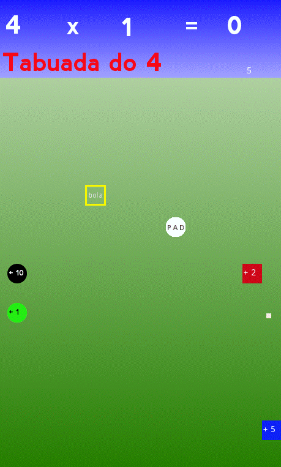

# **Tabuadas Pong**

  

# Sobre
> Este simples jogo 2D é parte de um conjunto experiental de jogos educativos, foi desenvolvido usando Godot Engine usando a linguagem GDScrip. (parecida com python)  
> Resolva as tabuadas jogando um jogo do tipo pong. (ainda em desenvolvimento)
>
>  

# Aspectos
> - Este jogo está em desenvolvimento.
> - Este é um jogo pong onde você, jogando, deve resolver tabuadas
> - As tabuadas variam aleatóriamenta da de 2 até a tabuada do 12.
> - As posições dos quadrados numéricos também são geradas aleatoriamente.
> - O resultado de cada multiplicação é definido pela soma dos impactos da bola ou do pad sobre os quadrados numerados.
> - Cuidado: a velocidade da bola se altera com a velocidade do impacto do pad. 
> - O impacto do pad também altera o sinal do quadrado numerado.(p.ex.: 5 se torna -5) 
> - A cada impacto o quadrado numerado muda aleatoriamente de posição.
> - O quadrado amarelo lança uma nova bola quando atingido.
> - Cuidado: podem existir muitas bolas ao mesmo tempo.
> - Cuidado: podem surgir novos quadrados amarelos ao mesmo tempo.
> - Existe um contador de tempo, por enquanto, meramente para sua própria informação.
> - Você vence o jogo ao completar uma respectiva tabuada.

# Layouts
> ## Uma página inicial típica
> - O tipo da tabuada e a posição dos quadrados são gerados aleatóriamente.    
> 

> ## No meio de um jogo típico.
> - Parabéns, você acertou o resultado d 4 x 8 !!!  
> - Vamos agora resolver 4 x 9 ?!  
> 

# Modelos
> - Godot adota em seu núcleo um projeto com orientação a objetos com um sistema flexível de cenas e hierarquias em nós.
> - Árvores de nós (nó: o menor bloco de construção) que agrupa-os em cenas.
> - Nós se comunicam entre si através de sinais. 
> - Um script na linguagem GDScript é uma classe que estende (herda) uma classe nó ou uma nova classe original.

# Tecnologias
> - Godot engine 2.1.4
>     - http://downloads.tuxfamily.org/godotengine/2.1.4/
> - GDScript (parecido com python)

# Rodando o jogo
> - Faça o download do godot e do jogo.
> - Inicie o godot e importe o arquivo engine.cfg no diretório raiz do jogo.
> - Rode em modo de desenvolvimento ou compile (exporte) para android, ios, windows, linux, etc.

# Author
> Pedro Vitor Abreu
>
> <soft.pva@gmail.com>
>
> <https://github.com/softpva